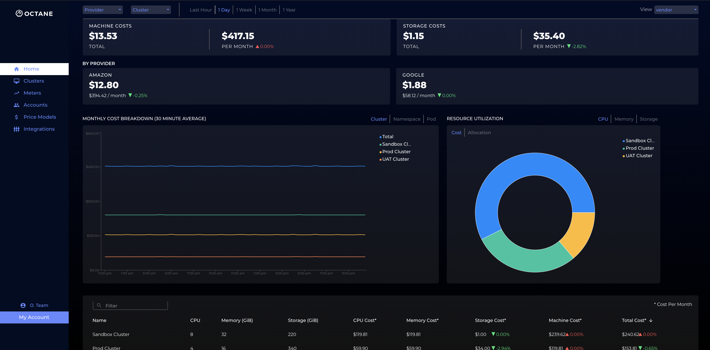

<p align="center"></p>


# Octane: Kubernetes Cost Engine

Octane help Development Teams easily  **manage their cloud spend on Kubernetes**Octane provideds detailed cost attribution of Infrastructure consumption (e.g. cpu, mem, storage) to Kubernetes resources (clusters, namespaces, pods). 

Octane makes it easier to get a real time view into financial spend on your cloud infrastructure. It works on any main cloud provider (AWS, GCP, Azure).

## Core Features

  - Detailed cost attribution for pods per application
  - consolidation of spend across multiple clusters (e.g. aws + gcp cluster cost in a single pane)
  - Filter spend by pod, namespace, cluster
  - Filter spend by Compute and Storage
  - Get % changes day over day of spend changes
  - Cost attribution by Teams (e.g. Security Team spent $400 today)
  ** Coming Soon 
  - GPU Attribution per pod
  - Data Transfer Costs 

## Installation

Reach out to support@getoctane.io to get an OCTANE_PROVIDED_KEY to begin using the cost engine. Replace the OCTANE_PROVIDED_KEY with the octane key provided by support. Then execute the command

```bash
sed -e "s/REPLACE_CLUSTER_KEY/OCTANE_PROVIDED_KEY/" < install-octane-collector.yaml > install-octane-collector.yaml
```

Once you have updated the yaml file with the appropriate octane key, install octane into your cluster to begin getting cost:
```bash
kubectl apply -f install-octane-collector.yaml
```
## Usage

1) Head over to https://www.cloud.getoctane.io

2) Enter the username and password given to you by the Octane Support Team

3) Voila! You should see real-time cost data coming in.

<p align="center"></p>
