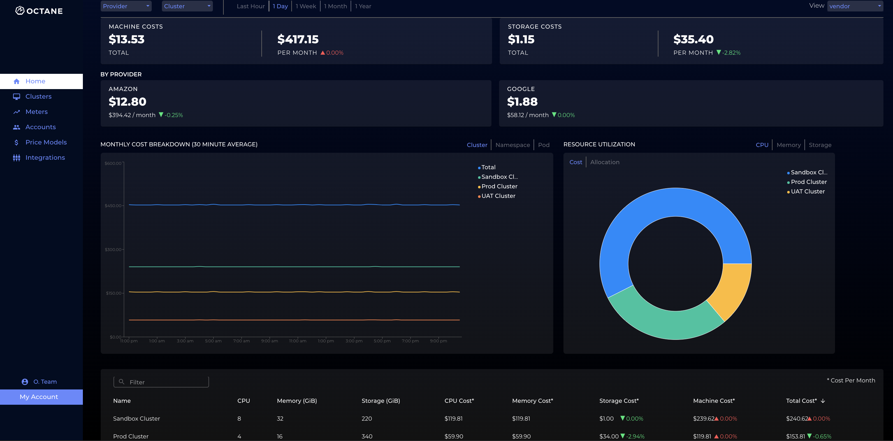

<p align="center"></p>


# Octane: Kubernetes Cost Engine

Octane helps Development Teams easily  **manage their cloud spend on Kubernetes**. Octane provides detailed cost attribution of running infrastructure (e.g. cpu, mem, storage) to Kubernetes resources (clusters, namespaces, pods).

Octane makes it easy to get a real time view into financial spend on your cloud infrastructure. It works on any main cloud provider (AWS, GCP, Azure).

## Core Features

  - Detailed cost attribution for pods per application
  - Consolidation of spend across multiple clusters (e.g. aws + gcp cluster cost in a single pane)
  - Filter spend by pod, namespace, cluster
  - Filter spend by Compute and Storage
  - Get % cost changes day over day
  - Cost attribution by Teams (e.g. Security Team spent $400 today)
  - GPU Attribution per pod
  - Data Transfer Costs

## Installation

Reach out to support@getoctane.io to get an Octane _cluster key_ to begin using
the cost engine. Replace OCTANE_CLUSTER_KEY with the octane key provided by
support and execute the following command:

```bash
helm install octane-collector ./helm/charts/collector \
  --set ledgerHost=https://api.demo.getoctane.io \
  --set clusterKey=OCTANE_CLUSTER_KEY
```

## Usage

1) Head over to https://cloud.getoctane.io

2) Enter the username and password given to you by the Octane Support Team

3) Voila! You should see real-time cost data coming in. [NOTE: it will take roughly 5 minutes for the data to start populating in UI]

<p align="center"></p>
